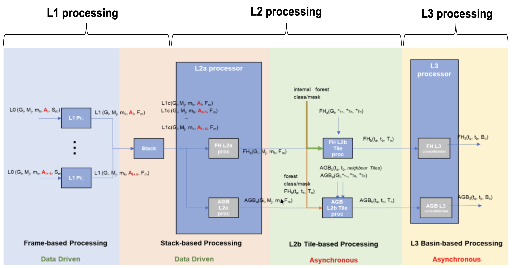
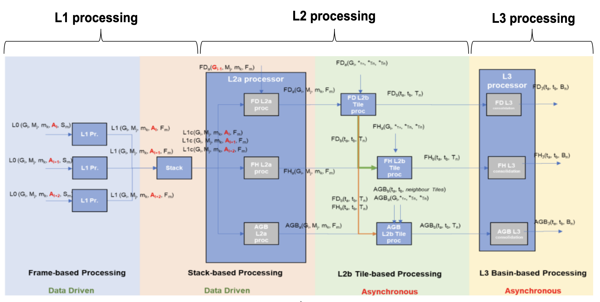
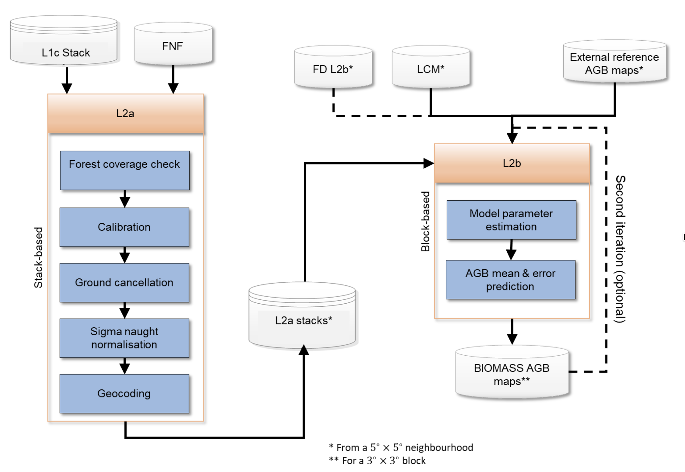

<!-- SPDX-FileCopyrightText: 2026 European Space Agency (ESA) -->
<!-- SPDX-License-Identifier: Apache-2.0 -->

```{include} ../_includes/atbd-logo-banner.md
```


# 2. BPS and AGB Processing Overview

### 2.1 BPS Overview

The BIOMASS Processing Suite (BPS) is in charge of processing BIOMASS Level-0 data
up to Level-3, generating a wide set of products. Product generation is depicted in
separate figures for the TOM phase and the INT phase. The processing foresees the
following steps:

- **L1 processing**: the BIOMASS image formation step, taking as input one L0 slice
  and generating as output N ≥ 1 L1 frames;
- **Stack processing**: coregistration and stacking that defines the required 7-image
  tomographic stacks or the 3-image interferometric stacks, including stack phase
  calibration;
- **L2a processing**: per-stack processing that provides inputs to tile generation
  performed by the L2b processors. For one global cycle the number of stacks varies
  mainly with latitude, approximately from a minimum of two at the Equator
  (ascending/descending) to about six at higher latitudes (three ascending/descending
  pairs);
- **L2b processing**: aggregates all stack-based L2a products over the same ground
  location (tile) in the same time interval and generates a single BIOMASS L2b product.
  The number of stacks available per DGG tile varies based on tile dimensions and swath
  coverage {rd}`8`;
- **L3 processing**: consolidation processing removing discontinuities in L2b products.

(fig:atbd-agb-bps-scheme-tom)=
:::{div} atbd-mermaid-figure

<div class="atbd-figure-content">



</div>

<p class="atbd-figure-caption"><span class="caption-number">Fig. 1</span><span class="caption-text"> — Biomass high-level processing scheme from L0 data to L3 products, TOM phase.</span></p>

:::

(fig:atbd-agb-bps-scheme-int)=
:::{div} atbd-mermaid-figure

<div class="atbd-figure-content">



</div>

<p class="atbd-figure-caption"><span class="caption-number">Fig. 2</span><span class="caption-text"> — Biomass high-level processing scheme from L0 data to L3 products, INT phase.</span></p>

:::

### 2.2 AGB Processing Overview

The AGB processing has as main goal the generation of maps of above ground biomass
density at a spatial resolution roughly equivalent to ~200 m × 200 m (i.e. 4 ha) at the
Equator {ad}`2`. It receives as input a stack of BIOMASS Level-1c images (SCS
co-registered and calibrated stack), including its relevant annotated data {ad}`3`. The AGB
processing is divided into three levels:

- L2a, generates a ground cancelled GN product, corresponding to L1 acquisitions
  filtered in order to attenuate ground scattering and enhance canopy scattering;
  interferometric diversity is used to perform filtering, so that only polarimetric
  diversity remains after filtering;
- L2b, generates above ground biomass density map from all the L2a products on a
  connected group of DGG tiles, as well as a quality map, training on external reference
  AGB {rd}`10`;
- L3, consolidates the result removing discontinuities in L2b products.

```{note}
Provided that FD algorithm proper validation will only be possible with BIOMASS in
orbit, the strategy proposed to deal with FH/AGB dependency on FD is to initially input
to FH/AGB a forest/non-forest mask generated outside of BPS {ad}`1` {ad}`2`. After
testing FD performance with BIOMASS in orbit, FD dependency can be switched on
again, provided it has a satisfactory performance. The diagram of {fig}`2` reports
nonetheless FD input for completeness.
```

```{note}
L2 processor receives from Stack processor L1c products with two co-polarization (CP)
channels and one cross-polarization (XP) channel. Details on the aggregation of XP
channels into one XP are reported in {rd}`1`.
```

```{note}
Regarding stack images cardinality, their number can vary (not always 3 or 7) due to
contingency reasons and it can go up to 8 in TOM phase.
```

### 2.3 AGB Processing Workflow and Algorithmic Overview

The main steps of the AGB processing workflow are depicted in the following figure and
described in detail in the following sub-sections. This algorithm is a tailoring of the one
described in {rd}`11`.

(fig:atbd-agb-workflow)=
:::{div} atbd-mermaid-figure

<div class="atbd-figure-content">



</div>

<p class="atbd-figure-caption"><span class="caption-number">Fig. 3</span><span class="caption-text"> — AGB processing detailed workflow. 5°x5° neighbourhood and 3°x3° processing block are shown in <a class="reference internal" href="../04-agb-estimation.html#fig-atbd-agb-processing-blocks">Fig.12</a>.</span></p>

:::

#### 2.3.1 Ground cancellation (L2A_P)

The main steps of the stack-based L2a block are:

- forest coverage check: predetermine which input data (as a whole image) should need
  to be processed;
- calibration: application of phase calibration and ground steering (terrain at zero
  elevation) screens to the stack;
- ground cancellation: removes the contribution of the ground scattering from the stack;
- sigma naught calibration: removes the first-order dependence on incidence angle and
  normalizes to resolution cell area;
- geocoding: projects the processed data on a geographic map, accounting for the
  different forest point locations with respect to the reference DEM.

#### 2.3.2 Above-ground biomass density estimation (L2B_AGB_P)

The main steps of the L2b block are:

- selection of training data: checking for availability of training AGB data within the L2a
  stacks and selecting the appropriate source (either external reference AGB data or
  previous version of the BIOMASS AGB map);
- training data extraction: extracting data from the extent of a tile and its neighborhood,
  matching pixels with reference AGB and forest type information with pixels from L2a
  stacks;
- parameters estimation: estimating AGB model parameters;
- AGB mean and standard error estimation: extracting L2a stack data within the current
  tile and creating maps of AGB mean and standard error.

#### 2.3.3 Note on interpretation of inputs and outputs tables

Inputs and outputs for each processing sub-step are summarised in specific subsections
(two subsections for each sub-step). A specific tabular format is defined to improve
access to the document. The meaning of each column is exemplified in the following table.

| Column | Meaning |
|---|---|
| Symbol | Mathematical symbol of the quantity appearing in formulas |
| Name | Name of the quantity as related to other BPS documentation (e.g. AUX_FMT, L1 ATBDs) |
| Origin / Destination | BPS document name describing the origin of the quantity, processing step, or destination product |
| Size | Dimensions of the quantity |
| Variability | Range of values or update rate of an internal resource |
| Default | Default value for configuration parameters |
| Description | Verbal description of the quantity and its characteristics (e.g. measurement units) |

