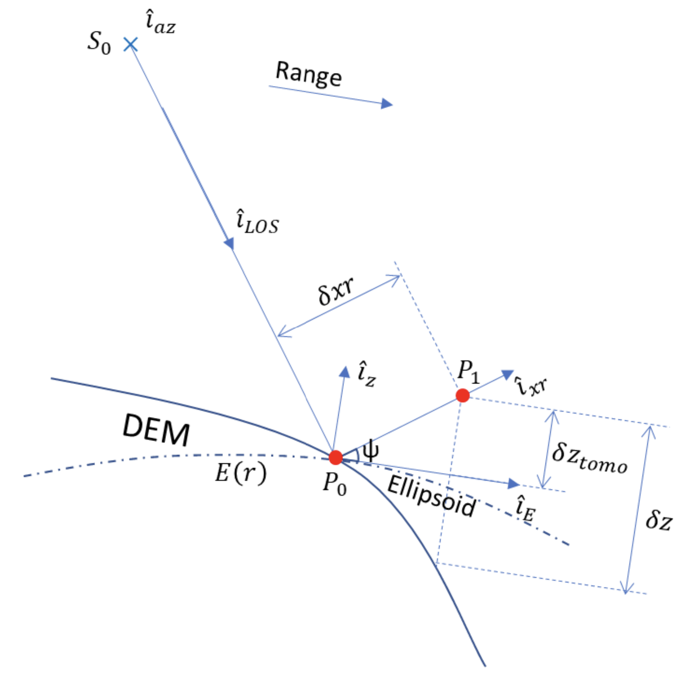

<!-- SPDX-FileCopyrightText: 2026 European Space Agency (ESA) -->
<!-- SPDX-License-Identifier: Apache-2.0 -->

:::{atbd-logo-banner}
:::


# 3. Ground cancellation (L2A_P)

The overall scheme of the L2a processing is reported in {fig}`3`.
The key steps is ground cancellation. These steps are described in detail in the following
subsections.

### 3.1 Forest Coverage Check

#### 3.1.1 Overview and rationale

The availability of a general FNF map allows to predetermine which input data (as a
whole image) should need to be processed. A threshold (mF) must be set as input
parameter to select the minimum forest coverage (as a percentage of the whole area
covered by the images) to start or skip computation.

**The step is optional. If unset, change detection computation is always performed for
all the data elements.**

#### 3.1.2 Inputs

| Symbol | Name | Origin | Size | Variability | Default | Description |
|---|---|---|---|---|---|---|
| FNF | FNF | Internal resource (IODD) | $[N_{lat,FNF} \times N_{lon,FNF}]$ | Yearly | - | A global forest-non-forest mask given as input |
| mF | forestCoverageThreshold | AUX_PP2_2A (AUX_FMT) | float value [scalar] | 0.0-100.0 | 5.0 | The minimum [%] relative forest coverage that triggers the computations |
| BB | Footprint | L1c main product header (L1_PFD) | lat-lon vertices [4 couples] | - | - | The extent of the L1c input data in geographical coordinates |

#### 3.1.3 Outputs

| Symbol | Name | Destination | Size | Variability | Default | Description |
|---|---|---|---|---|---|---|
| TR | trigger | Next steps | Boolean [scalar] | - | True | Allows to trigger (True) the computation of the change detection |

#### 3.1.4 Algorithm mathematical background

The values of the FNF mask that lie within the area covered by the image, defined by
the bounding box BB, are extracted from the global FNF mask. The relative number
of forested pixels is compared to the required minimum threshold mF to trigger any
subsequent computation.

$$
TR = \left(100 \cdot \frac{ForestedArea|_{BB}}{TotalArea|_{BB}} > mF\right)
\tag{3.1}
$$ (eq:forest-coverage-check-1)

#### 3.1.5 Notes on implementation

The substep should be as fast as possible, as its unique role is to avoid any un-useful
computation. Thus, comparison is carried on at the original FNF mask spatial sampling
(i.e. no reprojection needed), as any resampling does not have any impact on the
relative percentage of forested area with respect to the total covered area.

It must be noted that any noValue pixel in FNF is treated as ForestedArea sample to
avoid skipping computation because of the presence of noValues in FNF.

Details on the derivation of external FNF are reported in {rd}`10`.

### 3.2 INT subsetting (TOM only)

#### 3.2.1 Overview and rationale

The algorithm applies to TOM stacks and subsets the stack in order to select (or not)
the acquisitions. The subsetting rule applicable at the moment follows a geometric
criterion. Other rules could be defined post-launch. A no-subsetting rule is also
available ("maintain all", allowing to perform L2A_GN_P core algorithm on the full
tomographic acquisition stack. **Note that this rule is only available for L2A_GN
processing, and an error is generated if the rule is applied to other L2a processing
submodules.**

**This step is mandatory for TOM only.**

#### 3.2.2 Inputs

| Symbol | Name | Origin | Size | Variability | Default | Description |
|---|---|---|---|---|---|---|
| SCS | L1c | Stack processor (L1_PFD) | M, each acquisition $[N_{rg} \times N_{az}]$ | M=7/8 acquisitions (TOM phase), with two CP and one XP | - | L1c stack |
| — | subsettingRule | AUX_PP2_2A (AUX_FMT) | String | - | "geometry" | Select 3 acquisitions from the 7/8 of TOM phase, choosing, with a geometrical rule, the baselines corresponding to the ones of INT phase. A no selection rule ("maintain all") is available for GN processing only |

#### 3.2.3 Outputs

| Symbol | Name | Destination | Size | Variability | Default | Description |
|---|---|---|---|---|---|---|
| SCS | L1c | Calibration step | M, each acquisition $[N_{rg} \times N_{az}]$ | M=3…8 acquisitions, with two CP and one XP | - | L1c stack |

#### 3.2.4 Algorithm mathematical background

##### 3.2.4.1 Geometry criterion

The "geometry" criterion for subsetting selects among the seven/eight TOM stack the three
acquisitions that give nominally consistent baselines with INT phase. As different
combinations are possible, see {fig}`4`, the default rule is to select the central combination,
which is corresponding to exactly the same nominal situation as INT. In case this combination
presents a missing acquisition, the rule is to then evaluate remaining combinations in
sequential order until a three-acquisitions combination is found. If no combination of three
exists, the minimum required is two and the maximum baseline is equivalent to double TOM
spacing. The contingency case with eight TOM acquisitions is reported in {fig}`5`.

(fig:atbd-agb-int-subset-7)=
:::{div} atbd-mermaid-figure

<div class="atbd-figure-content">

| Evaluation order | 0 | 1 | 2 | 3 | 4 | 5 | 6 | TOM stack |
|:-:|:-:|:-:|:-:|:-:|:-:|:-:|:-:|:---|
| Evaluation order | ✓ | ✓ | ✓ | ✓ | ✓ | ✓ | ✓ | |
| 2 | ✓ | | ✓ | | ✓ | | |  |
| 1 | | ✓ | | ✓ | | ✓ | | **Default**  |
| 3 | | | ✓ | | ✓ | | ✓ |  |

</div>

<p class="atbd-figure-caption"><span class="caption-number">Fig. 4</span><span class="caption-text"> — Selection for seven TOM.</span></p>

:::

(fig:atbd-agb-int-subset-8)=
:::{div} atbd-mermaid-figure

<div class="atbd-figure-content">

| Evaluation order | 0 | 1 | 2 | 3 | 4 | 5 | 6 | 7 | Notes |
|:-:|:-:|:-:|:-:|:-:|:-:|:-:|:-:|:-:|:---|
| Evaluation order | ✓ | ✓ | ✓ | ✓ | ✓ | ✓ | ✓ | ✓ | TOM stack  |
| 2 | ✓ | | ✓ | | ✓ | | | |  |
| 1 | | ✓ | | ✓ | | ✓ | | | **Default** |
| 3 | | | ✓ | | ✓ | | ✓ | | |
| 4 | | | | ✓ | | ✓ | | ✓ | |

</div>

<p class="atbd-figure-caption"><span class="caption-number">Fig. 5</span><span class="caption-text"> — Selection for eight TOM (contingency).</span></p>

:::

### 3.3 Calibration

#### 3.3.1 Overview and rationale

The calibration algorithm makes use of the L1c annotation {ad}`3` to apply phase calibration
to L1c necessary for the L2a processing.

(fig:atbd-agb-calibration)=
:::{div} atbd-mermaid-figure

<div class="atbd-figure-content">

```{mermaid}
%%{init: {"flowchart": {"curve": "basis", "useMaxWidth": true, "htmlLabels": true, "padding": 10, "wrappingWidth": 300, "nodeSpacing": 35, "rankSpacing": 100, "subGraphTitleMargin": {"top": 0, "bottom": 24}}}}%%
flowchart TD
    subgraph stack["L1c stack + Phase screens"]
        direction LR
        S1[/"SCS₁"/] --- S2[/"SCS₂"/] --- S3[/"..."/] --- SM[/"SCS_M"/]
    end

    B["Screen calibration<br/>Phase screen subtraction"]

    subgraph out["L1c stack Phase calibrated / ground steered"]
        direction LR
        C1[/"SCS₁"/] --- C2[/"SCS₂"/] --- C3[/"..."/] --- CM[/"SCS_M"/]
    end

    stack --> B --> out
```


</div>

<p class="atbd-figure-caption"><span class="caption-number">Fig. 6</span><span class="caption-text"> — Calibration.</span></p>

:::

**The step is mandatory. If disabled for debug, default rule is to copy inputs as step
output.**

#### 3.3.2 Inputs

| Symbol | Name | Origin | Size | Variability | Default | Description |
|---|---|---|---|---|---|---|
| SCS | L1c | Stack processor, or INT subsetting step | M, each acquisition $[N_{rg} \times N_{az}]$ | M=3…8 acquisitions, with two CP and one XP | - | L1c stack |
| $\varphi_{skp}$ | skpCalibrationPhasesScreen | L1c reference acquisition ADS (L1_PFD) | M, each $[N_{rg,\varphi} \times N_{az,\varphi}]$ (zero for reference acquisition) | - | - | SKP calibration phase screens [rad] |
| $\varphi_{flattening}$ | flatteningPhasesScreen | L1c reference acquisition ADS (L1_PFD) | M, each $[N_{rg,\varphi} \times N_{az,\varphi}]$ (zero for reference acquisition) | - | - | Ground steering (flattening) geometry phase screens [rad] |
| — | applyCalibrationScreen | AUX_PP2_2A (AUX_FMT) | String | 'skp', 'geometry', 'none' | skp | Choose the phase calibration to be performed: skp or geometry if phase screens calibration should be applied, none otherwise |

#### 3.3.3 Outputs

| Symbol | Name | Destination | Size | Variability | Default | Description |
|---|---|---|---|---|---|---|
| SCS | L1c | Ground cancellation processing step | M, each acquisition $[N_{rg} \times N_{az}]$ | M=3…8 acquisitions, with two CP and one XP | - | Phase calibrated and ground steered (terrain at zero level) L1c stack |

(sec:calibration-math)=
#### 3.3.4 Algorithm mathematical background

This step aims to remove all the phase disturbances from the L1c stack and set terrain phase
at zero height (i.e., subtract DTM phase). Each polarization channel is processed
independently. The SCS L1c stack provided as input contains a set of calibration and ground
steering phase screens (SKP calibration screens and flattening phases screens described in
{rd}`1`). Depending on applyCalibrationScreen configuration, the used screen is:

$$
\varphi = \varphi_{skp} + \varphi_{flattening} \quad \text{if applyCalibrationScreen= "skp"}
$$

$$
\varphi = \varphi_{flattening} \quad \text{if applyCalibrationScreen= "geometry"}
$$

The operation implemented in the calibration step of the L2 processor is simply the
subtraction of the selected calibration phase screens from the input image stack phase. The
operation can be expressed as:

$$
SCS(r, a, n) = SCS(r, a, n)\, e^{-j\varphi(r,a,n)}
\tag{3.2}
$$ (eq:calibration-1)

where $\varphi(r,a,n)$ is the phase screen accounting for all the disturbance terms and terrain
topography relative to the baseline $n$ for each pixel in azimuth $a$, slant-range $r$. In the case of
the reference acquisition, no compensation is done (zero baseline). If the phase screens
have a lower resolution than the SCSs then a preliminary interpolation step is needed. The
operation can be expressed as:

$$
\varphi(r, a, n) = f[\varphi(r, a, n)|_{(rg,\varphi,az,\varphi)}]|_{(rg,az)}
\tag{3.3}
$$ (eq:calibration-2)

where f is a bilinear interpolant function.

### 3.4 Ground cancellation

#### 3.4.1 Overview and rationale

Ground cancellation {rd}`4` is the interferometric combination of two or more images so that
the backscattered echo coming from the ground level is cancelled. This processing step can
be carried out starting from the calibrated and ground steered stack of SAR images (so that
the phase of the ground contribution is aligned in the images). Consequently, the radar signal
coming from a particular elevation gets emphasized. This specific elevation depends on the
spatial baseline characterizing the interferometric system, depending on the geometry of
acquisition, and cannot usually be chosen when processing the data. However, the
availability of more than two interferometric images allows this specific elevation to be
selected. This is referred to as interpolated ground cancellation. In case the quantity of
interest is ground cancelled backscatter (intensity), filtering can be computed for all possible
reference selection and intensity is finally averaged. This is called multi-reference ground
cancellation, which is the default setting. The processing steps are described in the following,
for two images and with several images.

**The step is mandatory. If disabled for debug, default rule is to set
$I_{GN}$ (see {sec}`section|3.4.3`) to primary image acquisition.**

#### 3.4.2 Inputs

| Symbol | Name | Origin | Size | Variability | Default | Description |
|---|---|---|---|---|---|---|
| SCS | L1c | Calibration processing step | M, each acquisition $[N_{rg} \times N_{az}]$ | M=3…8 acquisitions, with two CP and one XP | - | Phase calibrated and ground steered (terrain at zero level) L1c stack |
| $k_z$ | Wavenumber | L1c Stack ADS (L1_PFD) | M, each $[N_{rg,k} \times N_{az,k}]$ (zero for reference acquisition) | - | - | Vertical wavenumbers [1/m] computed with respect to incidence on inflated ellipsoid |
| $z_0$ | emphasizedForestHeight | AUX_PP2_2A (AUX_FMT) | float value [scalar] | Global single value* for all polarizations and all pixels | 30.0 | Desired elevation emphasized from ground cancellation, meters [m] |
| — | disableGroundCancellationFlag | AUX_PP2_2A (AUX_FMT) | Boolean [scalar] | - | False | True to disable ground cancellation: for debug |
| — | operationalMode | AUX_PP2_2A (AUX_FMT) | String | - | "multi reference" | Choose the Ground Cancellation method to use |
| — | imagesPairSelection | AUX_PP2_2A (AUX_FMT) | List of integers | - | - | Optional, needed only when operationMode="insarPair" and more than 2 images are available |

```{note}
Analysis can be carried out post-launch to assess whether this value can be made forest-class dependent.
```

The default operation mode of ground cancellation is operationalMode="multi reference" with
full INT stack {rd}`7`. To operate with a single pair configuration must be set to "insar pair"
and the pair can be selected through imagesPairSelection. In case of only two images
available, the operationalMode is automatically set to "insar pair".

(sec:ground-cancellation-outputs)=
#### 3.4.3 Outputs

| Symbol | Name | Destination | Size | Variability | Default | Description |
|---|---|---|---|---|---|---|
| $\lvert I_{GN}\rvert^2$ | — | Sigma naught normalisation | $[N_{rg} \times N_{az}]$ | Two CP and one XP (independent from M) | - | Ground cancelled intensity image |

#### 3.4.4 Algorithm mathematical background

The flowcharts of the ground cancellation algorithm are shown in {fig}`7`, {fig}`8`. Each
polarization channel is processed independently. A preliminary interpolation step is needed
to bring wavenumbers onto the same L1c grid, in similar fashion as for the calibration screens
({sec}`Section|3.3.4`).

(fig:atbd-agb-gc-two)=
:::{div} atbd-mermaid-figure

<div class="atbd-figure-content">

```{mermaid}
%%{init: {"flowchart": {"curve": "basis", "useMaxWidth": true, "htmlLabels": true, "padding": 10, "wrappingWidth": 300, "nodeSpacing": 35, "rankSpacing": 100, "subGraphTitleMargin": {"top": 0, "bottom": 24}}}}%%
flowchart TD
    subgraph stack["L1c stack — phase calibrated / ground steered"]
      direction LR
        S1["SCS₁"] --- S2["SCS₂"]
    end
    B["Images subtraction"]
    O["GN"]
    stack --> B --> O
```

</div>

<p class="atbd-figure-caption"><span class="caption-number">Fig. 7</span><span class="caption-text"> — Ground cancellation algorithm with two images.</span></p>

:::

(fig:atbd-agb-gc-multi)=
:::{div} atbd-mermaid-figure

<div class="atbd-figure-content">

```{mermaid}
%%{init: {"flowchart": {"useMaxWidth": true, "htmlLabels": true, "padding": 10, "wrappingWidth": 300, "nodeSpacing": 35, "rankSpacing": 100, "subGraphTitleMargin": {"top": 0, "bottom": 24}}}}%%
flowchart TD
    subgraph VW["Vertical Wavenumbers (back-geocoding product)"]
      direction LR
        VW1[/"VW₁"/] --- VW2[/"…"/] --- VW3[/"VW_M"/]
    end
    subgraph SCS["L1c stack — phase calibrated / ground steered"]
      direction LR
        SCS1[/"SCS₁"/] --- SCS2[/"…"/] --- SCS3[/"SCS_M"/]
    end
    
    
    D["Demodulation"]
    H["Height to emphasise"]
    REF["Reference acquisition selection"]
    LI["Linear interpolation"]
    M["Modulation"]
    RS["Reference image subtraction"]
    GN["GN"]
    
    VW --> REF
    VW --> D
    
    SCS --> D
    SCS --> REF
    
    REF --> D
    REF --> RS
    D --> LI --> M --> RS --> GN
    H --> LI
```

</div>

<p class="atbd-figure-caption"><span class="caption-number">Fig. 8</span><span class="caption-text"> — Ground cancellation algorithm with more than two images.</span></p>

:::

(sec:ground-cancellation-two-images)=
##### 3.4.4.1 Case of two images

The processing for just two images is a simple subtraction of the second image from the first,
as represented by

$$
I_{GN}(r, a) = SCS(r, a, 1) - SCS(r, a, 2)
\tag{3.4}
$$ (eq:ground-cancellation-1)

which holds for each polarization channel, for pixel in azimuth $a$, slant-range $r$. The first image
is not required to be the reference acquisition, as symmetrical quantities, such as the
covariance matrix or impulse response function of the ground cancellation (absolute value)
are not affected by the order chosen for subtraction {rd}`4`.

##### 3.4.4.2 Interpolated ground cancellation single reference

For a stack of coherent ground steered SCS images (M>2) a further degree of freedom is
available: a given elevation above the ground level can be chosen and emphasized together
with removal of the ground echo. The desired elevation $z_0$ must be converted into a
wavenumber before feeding it to the routine, using the relation:

$$
k_{z0} = \frac{\pi}{z_0}
\tag{3.5}
$$ (eq:ground-cancellation-2)

A synthetic SCS associated with the desired wavenumber can be produced by linearly
interpolating the stack. To ensure that the backscattering contribution associated with the
desired elevation is not distorted by the interpolation process the stack is demodulated so
that the desired elevation is steered around 0 m; the elevation to be demodulated coincides
with half of the desired elevation. The demodulation is expressed by

$$
I_{k_z}(r, a, n) = SCS(r, a, n)\, e^{-j k_z(r,a,n)\, z_0/2}
\tag{3.6}
$$ (eq:ground-cancellation-3)

The linear interpolation algorithm must recognize the previous
$k_z^{-}(r, a) = \max\{k_z(r, a, n) \in [k_z(r, a, n) < k_{z0}]\}$ and the next
$k_z^{+}(r, a) = \min\{k_z(r, a, n) \in [k_z(r, a, n) > k_{z0}]\}$ sampled wavenumbers of the stack and then implement

$$
I_{k_{z0}}(r, a) = I_{k_z}^{-}(r, a) + [I_{k_z}^{+}(r, a) - I_{k_z}^{-}(r, a)] \frac{k_{z0} - k_z^{-}(r,a)}{k_z^{+}(r,a) - k_z^{-}(r,a)}
\tag{3.7}
$$ (eq:ground-cancellation-4)

where $I_{k_z}^{-}$ and $I_{k_z}^{+}$ are the SCS images associated with the wavenumbers $k_Z^{-}$
and $k_Z^{+}$ respectively. After interpolation the spectrum is shifted back.

$$
I_{k_{z0}}(r, a) = I_{k_{z0}}(r, a)\, e^{j k_{z0}\, z_0/2}
\tag{3.8}
$$ (eq:ground-cancellation-5)

The synthetic image (independent from M) is then subtracted from the reference image

$$
I_{GN}(r, a) = I_{ref}(r, a) - I_{k_{z0}}(r, a)
\tag{3.9}
$$ (eq:ground-cancellation-6)

###### 3.4.4.2.1 Reference acquisition selection

In this case the reference acquisition $I_{ref}$ should be chosen as the one guaranteeing the
widest scene coverage where interpolation can be performed, around the desired value $k_{z0}$

$$
I_{ref} = \max_{SCS_n} \sum_{r,a} ({k_{z}}^{n}_{min}(r,a) < k_{z0})(k_{z0} < {k_{z}}^{n}_{max}(r,a))
\tag{3.10}
$$ (eq:ground-cancellation-7)

where $k_{z\,min}^{n}$ and $k_{z\,max}^{n}$ are the maximum and minimum wavenumbers of the set $k_z(r,a,n) -$
$k_z(r,a,ref)$ assuming $SCS_n$ as $I_{ref}$.

The reference acquisition selection is performed in a fully automatic way by the algorithm
and requires no configuration inputs or others. The aim of this step is to set the reference
acquisition to the one guaranteeing correct scene coverage and avoid gaps. The reference
selected by this step is not necessarily corresponding to the original L1c reference of the
stack. Anyway, the change of reference computed by this step is valid only for the purpose
of ground cancellation computation and does not imply any change of reference outside the
scope of this step. This step applies only to the interpolated single reference case, since in
the two images case there is no need to specify a reference acquisition as described in
{sec}`3.4.4.1`).

###### 3.4.4.2.2 Multi-reference selection

In case the quantity of interest is ground cancelled backscatter (intensity), filtering is be
computed for all possible reference selection and intensity is finally averaged.
Differently from what described in {sec}`3.4.4.2.1` this means the algorithm computes
automatically as many ground cancellation results as the acquisitions in the stack, assuming
each acquisition as a reference (denoted by n in following equations), following the same
equations detailed in {sec}`section|3.4.4.2`. Results are finally averaged:

$$
|I_{GN}(r, a)|^2 = I_{valid}(r, a) \sum_n |{I_{ref}}^{n}(r, a) - {I_{k_{z0}}}^{n}(r, a)|^2
\tag{3.11}
$$ (eq:ground-cancellation-8)

where $I_{ref}^{n}$ and $I_{k_{z0}}^{n}$ are reference and interpolated secondary assuming $SCS_n$ as $I_{ref}$ (which
implies wavenumber rescaling as described in {sec}`3.4.4.2.1`).
A weighting mask is computed, to account for each choice of reference for points that would
need extrapolation, which are to be discarded and effective valid occurrences to be averaged

$$
I_{valid}(r, a) = \frac{1}{\sum_n 1 - \{({k_{z}}^{n}_{min}(r,a) > k_{z0}) \lor (k_{z0} > {k_{z}}^{n}_{max}(r,a))\}}
\tag{3.12}
$$ (eq:ground-cancellation-9)

where ${k_{z}}^{n}_{min}(r,a)$ and ${k_{z}}^{n}_{max}(r,a)$ are the maximum and minimum wavenumbers of the set $k_z(r,a,n) -$
$k_z(r,a,ref)$ assuming $SCS_n$ as $I_{ref}$. Thus, only valid (i.e., non-extrapolated values) ground
cancelled pixels are averaged (summed and scaled by the effective number of contributions
as implied in {eq}`3.11`). If no valid ground cancelled results are available at a certain location,
the corresponding pixel is set as invalid.

### 3.5 Sigma naught normalisation

#### 3.5.1 Overview and rationale

The sigma naught normalization block aims to estimate the second order statistics of the
ground cancelled intensity data and to normalize for some first-order incidence angle
variability.

**The step is mandatory. If disabled for debug, default rule is to skip correction.**

(fig:atbd-agb-sigma-naught-normalisation)=
:::{div} atbd-mermaid-figure

<div class="atbd-figure-content">

```{mermaid}
%%{init: {"flowchart": {"useMaxWidth": true, "htmlLabels": true, "padding": 16, "wrappingWidth": 200, "nodeSpacing": 35, "rankSpacing": 40}}}%%
flowchart TD
    GN[/"GN"/]
    TH[/"Local incidence angle"/]
    W[/"Spatial averaging window size"/]
    SN["Sigma naught normalisation"]
    OUT[/"GN intensity σ⁰"/]

    GN --> SN
    TH --> SN
    W --> SN
    SN --> OUT
```

</div>

<p class="atbd-figure-caption"><span class="caption-number">Fig. 9</span><span class="caption-text"> — Sigma naught normalisation.</span></p>

:::

#### 3.5.2 Inputs

| Symbol | Name | Origin | Size | Variability | Default | Description |
|---|---|---|---|---|---|---|
| $\lvert I_{GN}\rvert^2$ | — | Ground cancellation processing step | $[N_{rg} \times N_{az}]$ | Two CP and one XP (independent from M acquisitions) | - | Ground cancelled intensity image |
| pRes | productResolution | AUX_PP2_2A (AUX_FMT) | float value [scalar] | - | 200.0 | Value in [m] to be used as the resolution on ground range map and also to perform the intensity averaging in radar coordinates |
| — | upsamplingFactor | AUX_PP2_2A (AUX_FMT) | int value [scalar] | - | 2 | upsamping factor, that modules the overall decimation in multilooking |
| $\theta$ | incidenceAngle | L1c reference acquisition ADS (L1_PFD) | $[N_{rg,\theta} \times N_{az,\theta}]$ | - | - | L1c stack reference acquisition incidence angle (on inflated ellipsoid) annotation [deg] |
| $\alpha$ | terrainSlope | L1c reference acquisition ADS (L1_PFD) | $[N_{rg,\alpha} \times N_{az,\alpha}]$ | - | - | Terrain slope [deg] |
| $B_r$ | L1c range-bandwidth | L1c reference acquisition ADS (L1_PFD) | - | - | - | L1c range bandwidth [Hz] |
| $B_a$ | L1c azimuth bandwidth | L1c reference acquisition ADS (L1_PFD) | - | - | - | L1c range bandwidth [Hz] |
| $v_a$ | L1c velocity annotation | L1c reference acquisition ADS (L1_PFD) | - | - | - | Average azimuth velocity [m/s] |
| rcFlag | radiometricCalibrationFlag | AUX_PP2_2A (AUX_FMT) | Boolean [scalar] | - | True | Flag to apply radiometric calibration |

#### 3.5.3 Outputs

| Symbol | Name | Destination | Size | Variability | Default | Description |
|---|---|---|---|---|---|---|
| $\sigma_{GN}$ | — | Geocoding | $[N_{pol} \times N_{rg,subs} \times N_{az,subs}]$ | - | - | Ground-notched backscatter coefficient of current stack |
| $\vartheta$ | — | Geocoding | $[N_{rg,subs} \times N_{az,subs}]$ | - | - | local incidence angle (wrt. ground surface normal) [rad] |

#### 3.5.4 Algorithm mathematical background

The sigma naught normalization block aims to estimate the intensity of the ground cancelled
intensity data. The size of the spatial averaging window used to estimate the second order
statistics depends on the final resolution of the products to be provided as an input. The
output is a 3D array with dimensions: $[N_{pol} \times N_{rg,subs} \times N_{az,subs}]$ where $N_{pol}$ the number of
polarizations, and $N_{rg,subs}$ and $N_{az,subs}$ are the numbers of slant-range and azimuth samples
after subsampling (half window size, well complying with the Nyquist-Shannon sampling
theorem). For each (subsampled) range-azimuth position a $N_{pol}$ vector proportional to sigma
naught is returned. Mathematically:

$$
\sigma_{GN\,p}(r, a) = \frac{1}{N_{\Omega_r} N_{\Omega_a}} \sum_{a \in \Omega_a} \sum_{r \in \Omega_r} \sin[\theta(r,a) - \alpha(r,a)]\, |I_{GN\,p}(r,a)|^2
\tag{3.13}
$$ (eq:sigma-naught-normalisation-1)

where $p$ denote the $p$-th polarimetric channel; $r$ and $a$ denote the slant-range and azimuth
indices; $\Omega_r$ and $\Omega_a$ denote the neighborhood in the slant-range and azimuth directions of the
desired position; $I_{GN\,p}(r, a)$ denotes the pixel value of ground cancelled complex image in
polarimetric channel $p$; α indicate terrain slopes in range direction, θ the incidence angle, ϑ=
$\theta - \alpha$ the local incidence angle (wrt. ground surface normal). The correction term
$\sin[\theta(r, a) - \alpha(r, a)]$ is applied only if rcFlag is set to True. A preliminary interpolation step is
needed to bring angles onto the same L1c grid, in similar fashion as for the calibration screens
({sec}`Section|3.3.4`).

The averaging window size is computed as:

$$
|\Omega_r| = \left\lceil \frac{pRes}{\rho_r \sin\theta_m (\Delta_r B_r)^{-1}} \right\rceil
\tag{3.14}
$$ (eq:sigma-naught-normalisation-2)

$$
|\Omega_a| = \left\lceil \frac{pRes}{\rho_a (\Delta_a B_a)^{-1}} \right\rceil
$$ 


where $\rho_r = \dfrac{c}{2B_r}$ and $\rho_a = \dfrac{v_a}{B_a}$ denote the L1c resolution computed from system bandwidth,
Lightspeed c, average azimuth velocity $v_a$, pRes is the L2 resolution, $\theta_m = \dfrac{1}{N_r N_a}\sum_{r,a} \theta(r, a)$
is the average incidence angle across the swath, while the terms $(\Delta_i B_i)^{-1}$, $i = r, a$ represent
the oversampling factor. SCS invalid pixels will not be used during processing. The presence
of an invalid SCS pixel causes the generation of an invalid covariance sample. The number
of looks L {rd}`6` is computed as:

$$
L = \left\lceil \frac{pRes^2}{\rho_r \rho_a}{\sin \theta_m} \right\rceil
\tag{3.15}
$$ (eq:sigma-naught-normalisation-3)

#### 3.5.5 Notes on implementation

It should be noted that, as implied by the equations above, multilooking is implicitly performed
while computing vector proportional to sigma naught. The ratio of subsampling (i.e., the step
where $\sigma_{GN}$ full matrix is sampled) of the final output matrix is ruled by the "upsamplingFactor"
parameter: when the assumed value is 1, full subsampling is applied (**N**rg|az,subs = **N**rg|az / **N**Ωr|az)
while when its value is higher, the final output matrix will be bigger (**N**rg|az,subs = **N**rg|az / **N**Ωr|az *
upsamplingFactor)

### 3.6 Geocoding

#### 3.6.1 Overview and rationale

The purpose of this step is to project the processed data onto a geographic map, accounting
for the different forest points location with respect to reference DEM.

:::{note}
NOTE: It should be noted that the use of the BIOMASS DTM {rd}`3` is to be preferred to other
DEM since it represents the true terrain level at P-band, necessary for correct geocoding.
:::

:::{note}
NOTE: this functionality is used by all three AGB, FD, FH processors with different I/O.
mathematical formulation is described highlighting the mapping of the different processors
I/O to geocoding formulas in each processor document. The functionality relies on L1c ADS
{rd}`1` and not on the L1 geocoding tool {rd}`2`.
:::

The step is mandatory.

(fig:atbd-agb-geocoding)=
:::{div} atbd-mermaid-figure

<div class="atbd-figure-content">

```{mermaid}
%%{init: {"flowchart": {"useMaxWidth": true, "htmlLabels": true, "padding": 16, "wrappingWidth": 200, "nodeSpacing": 35, "rankSpacing": 40}}}%%
flowchart TD
    PD["Processed data"]
    DEM["Reference DEM LLH coordinates (back-geocoding product)"]
    ELEV["Tomographic 3D forest points elevation"]
    ORB["L1c stack reference orbit"]
    DGG["DGG"]
    UC["Update coordinates"]
    PGM["Project on geographic map"]
    OUT["Geocoded processed data"]

    PD --> UC
    DEM --> UC
    ELEV --> UC
    ORB --> UC
    UC --> PGM
    DGG --> PGM
    PGM --> OUT
```

</div>

<p class="atbd-figure-caption"><span class="caption-number">Fig. 10</span><span class="caption-text"> — Geocoding.</span></p>

:::

#### 3.6.2 Inputs

| Symbol | Name | Origin | Size | Variability | Default | Description |
|---|---|---|---|---|---|---|
| $\sigma_{GN}$, $\vartheta$ → $R_d$ | — | Sigma naught normalisation processing step | $[N_{pol} \times N_{rg,subs} \times N_{az,subs}]$, $[N_{rg,subs} \times N_{az,subs}]$ | - | - | Processed data, in this case the ground-notched backscatter coefficient and local incidence angle of current stack |
| $(lat, lon, z_{P_0})$ | latitude longitude height | L1c reference acquisition ADS (L1_PFD) | 3x $[N_{rg,llh} \times N_{az,llh}]$ | - | - | Reference DEM latitude-longitude-height coordinates |
| $z_0$ → $\delta z_{tomo}$ | emphasizedForestHeight | AUX_PP2_2A (AUX_FMT) | float value [scalar] | Global single value (see previous note) for all polarizations and all pixels | 30.0 | Tomographic 3D forest points elevation [m], in this case the desired elevation emphasized from ground cancellation |
| DGG | DGG | Internal lookup table | - | - | - | DGG sampling |
| $\hat{i}_{az}$ | Orbit ADS | L1c reference acquisition ADS | - | - | - | L1c stack reference acquisition orbit annotation |

#### 3.6.3 Outputs

| Symbol | Name | Destination | Size | Variability | Default | Description |
|---|---|---|---|---|---|---|
| $R_d$ → $X$ | — | FNF annotation processing step | $[N_{pol} \times N_{lat} \times N_{lon}]$, $[N_{lat} \times N_{lon}]$ | - | - | ground-notched backscatter coefficient and local incidence angle of current stack projected onto a geographic map |

#### 3.6.4 Algorithm mathematical background

##### 3.6.4.1.1 Update reference DEM coordinates

(fig:atbd-agb-geocoding-forest-point)=
:::{div} atbd-mermaid-figure

<div class="atbd-figure-content">



</div>

<p class="atbd-figure-caption"><span class="caption-number">Fig. 11</span><span class="caption-text"> — Determining the elevation of one forest point. The picture represents a lateral section for one sensor azimuth position. Details of the represented quantities are given in the text description.</span></p>

:::

This step aims to account for the different forest points location with respect to reference
DEM. A preliminary interpolation step is needed to bring DEM latitude-longitude-height onto
the same L1c grid, in similar fashion as for the calibration screens ({sec}`Section|3.3.4`).
Determining the elevation of one forest point is shown in {fig}`11`:

- $(lat, lon, z_{P_0})$ is the reference DEM for the point $P_0$, which can be converted to
  Cartesian coordinates $(X_{P_0}, Y_{P_0}, Z_{P_0})$
- $z$ is normal direction to ellipsoid reported to DEM at point $P_0$, i.e., given the tangent
  plane to ellipsoid $a X + b Y + c Z + d = 0$ then $\hat{i}_z = [a, b, c]$
- $\hat{i}_{az}$ is the azimuth sensor direction, determined from reference orbit annotation
- $\hat{i}_{LOS} = \frac{P_0 - S_0}{|P_0 - S_0|}$ is line of sight vector, $S_0$ is the sensor position for the considered
  azimuth
- $\hat{i}_{xr} = \hat{i}_{az} \times \hat{i}_{LOS}$ is the cross range vector
- the ellipsoid direction at reference DEM is $\hat{i}_E \cdot \hat{i}_z = 0$, i.e., $\hat{i}_E =
  \frac{[dE(r)]}{dr}$ and $E(r) = [X_E(r), Y_E(r), Z_E(r)]$ are ellipsoid coordinates as a function of range
- $\delta z_{tomo}$ is one tomographic forest point elevation, in this case the desired elevation
  emphasized from ground cancellation
- $\delta z$ is the elevation of point P1 versus DEM (with respect to WGS84 geodetic system).
  Note that while this is represented for completeness in {fig}`11`, it is not explicitly needed to compute P1 [x,y,z] position in the
  following {eq}`eq|3.17`.

Then

$$
\delta x_r = \frac{\delta z_{tomo}}{|\hat{i}_{xr} \times \hat{i}_E|} = \frac{\delta z_{tomo}}{\sin(\psi)}
\tag{3.16}
$$ (eq:geocoding-1)

The geographic position of the forest point is:

$$
P_1 = P_0 + \hat{i}_{xr} \cdot \delta x_r
\tag{3.17}
$$ (eq:geocoding-2)

##### 3.6.4.1.2 Projection onto a geographic map

Once the updated coordinates of the points are computed, interpolation of each raster layer
to regular map coordinates projects the processed data onto a geographic map. In this case
the information layers ground-notched backscatter coefficient and local incidence angle $R_d =
\sigma_{GN}$, ϑ are both geocoded using the desired elevation emphasized from ground cancellation.
Geocoding is done in a way that the products are sampled the same way onto the DGG
sampling {rd}`8`. The operation can be expressed as:

$$
R_d(lat, lon, z) = f[R_d(lat, lon, z)|_{P_1}]|_{DGG}
\tag{3.18}
$$ (eq:geocoding-3)

where f is a bilinear interpolant a function, $R_d$ is each raster layer to be interpolated.

### 3.7 FNF annotation

#### 3.7.1 Overview and rationale

The purpose of this step is to annotate the FNF in the L2a product.

**The step is mandatory.**
#### 3.7.2 Inputs

| Symbol | Name | Origin | Size | Variability | Default | Description |
|---|---|---|---|---|---|---|
| FNF | FNF | Internal resource (IODD) | $[N_{lat,FNF} \times N_{lon,FNF}]$ | Yearly | - | A global forest-non-forest mask given as input |
| fMIT | forestMaskInterpolationThreshold | AUX_PP2_2A (AUX_FMT) | float value [scalar] | 0.0-1.0 | 0.5 | Threshold to fix rounding of pixels with decimal values originated from binary FNF interpolation onto L2a grid |
| $R_d$ | — | Geocoding step | $[N_{pol} \times N_{lat} \times N_{lon}]$, $[N_{lat} \times N_{lon}]$ | - | - | ground-notched backscatter coefficient and local incidence angle of current stack projected onto a geographic map |

#### 3.7.3 Outputs

| Symbol | Name | Destination | Size | Variability | Default | Description |
|---|---|---|---|---|---|---|
| $R_d$ | — | GN L2a product of current cycle (AGB_PFD) | $[N_{pol} \times N_{lat} \times N_{lon}]$, $[N_{lat} \times N_{lon}]$ | - | - | ground-notched backscatter coefficient and local incidence angle of current stack projected onto a geographic map |
| FNF | FNF | GN L2a product of current cycle (AGB_PFD) | $[N_{lat} \times N_{lon}]$ | - | - | Annotated forest-non-forest mask |

#### 3.7.4 Algorithm mathematical background

The operation can be expressed as:

$$
FNF(lat, lon) = f[FNF(lat, lon)|_{FNF}]|_{R_d}
\tag{3.19}
$$ (eq:fnf-annotation-1)

where f is a bilinear interpolant a function. Since interpolation generates border effects a
threshold $fMIT$ to fix rounding of pixels with decimal values is applied:

$$
FNF = FNF > fMIT
\tag{3.20}
$$ (eq:fnf-annotation-2)
