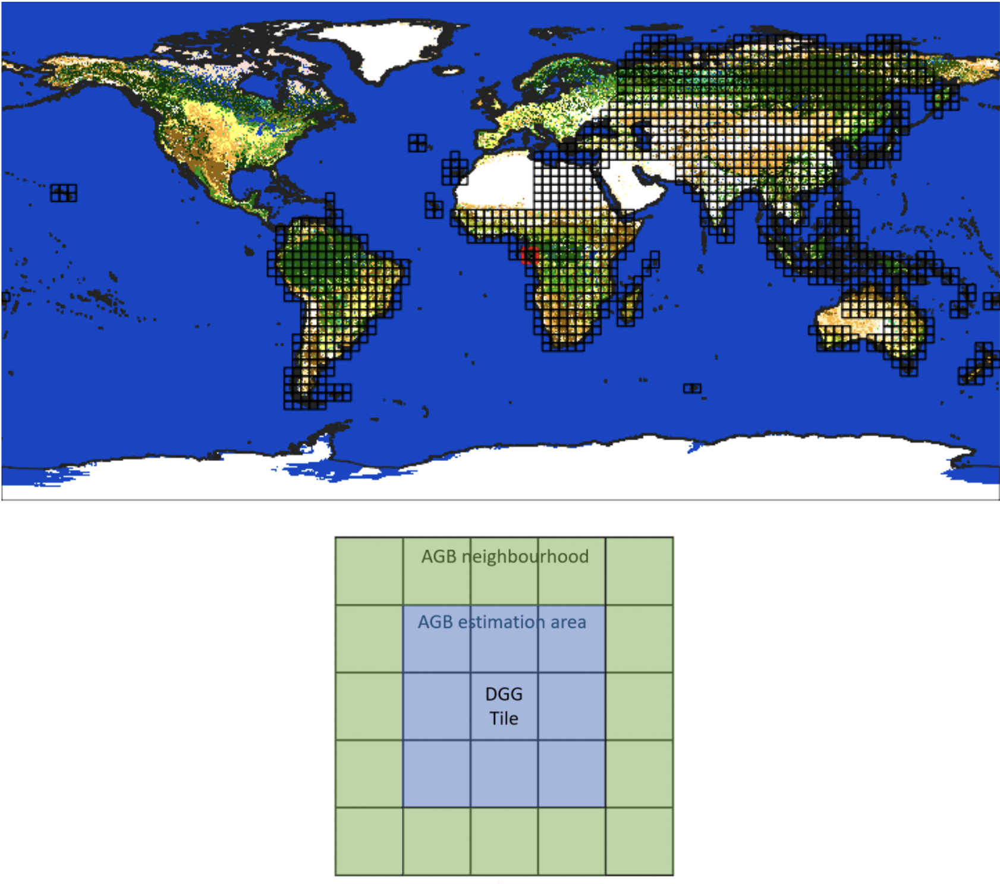

<!-- SPDX-FileCopyrightText: 2026 European Space Agency (ESA) -->
<!-- SPDX-License-Identifier: Apache-2.0 -->

```{include} ../_includes/atbd-logo-banner.md
```


# 4. AGB estimation (L2B_AGB_P)

The overall scheme of the L2b processing is reported in the figure below. The key step is the
conversion of multi-stack, ground-notched backscatter coefficients to estimates of AGB mean
and standard error. The associated steps are described in detail in the following subsections.

The world is divided into processing blocks covering all forested areas and not overlapping
with each other ({fig}`12`, top). This step is run separately for each 3°×3° processing block,
where the data for parameter estimation are extracted from a 5°×5° neighbourhood while the
estimated AGB mean and standard error maps are only saved for the 3°×3° processing block:
the neighbourhood consists of the processing block and includes a 1° buffer zone as shown
in ({fig}`12`, bottom).

(fig:atbd-agb-processing-blocks)=
:::{div} atbd-mermaid-figure

<div class="atbd-figure-content">



</div>

<p class="atbd-figure-caption"><span class="caption-number">Fig. 12</span><span class="caption-text"> — World covered by 3°×3° processing blocks (top) and 5°×5° neighbourhood for AGB estimation (bottom).</span></p>

:::

The algorithm performs up to two iterations for each processing block. The following
approach to orchestration is followed:

1. perform first iteration for all blocks: during first iteration, only external reference AGB
   mean and standard error are present as input over all the 5°x5° neighbourhood.
    
    a. the invalid AGB estimates (where corresponding regression parameters
      cannot be estimated) are tagged in output at a pixel level **AND** a flag is raised.
2. perform second iteration only for all blocks where invalid AGB (but still recoverable)
   estimates are present (based on the flag).The second iteration uses the output from
   the first iteration as reference (as an addition to external AGB estimates). Only pixels
   tagged as invalid form first iteration are recomputed.

{fig}`13` shows the flow chart for Level 2b processing for one processing block. Input  reference
AGB mean and std differs from first and second iteration:

- **first iteration**: external reference only
- **second iteration**: external reference + first iteration AGB output

(fig:atbd-agb-l2b-workflow)=
:::{div} atbd-mermaid-figure

<div class="atbd-figure-content">

```{mermaid}
%%{init: {"flowchart": {"curve": "basis", "useMaxWidth": true, "htmlLabels": true, "padding": 10, "wrappingWidth": 300, "nodeSpacing": 35, "rankSpacing": 100, "subGraphTitleMargin": {"top": 0, "bottom": 24}}}}%%
flowchart TD
    subgraph n5["All DGG tiles within 5°×5° neighbourhood"]
        FD["FD L2b"]
        REF["Reference AGB mean & std"]
        LCM1["LCM"]
      subgraph stacks["All stacks for the current global cycle"]
          SGN["Ground-notched σ_GN"]
          TH["Local incidence angle ϑ"]
          FNF["FNF"]
      end
    end
    subgraph l2b["L2b processing"]
        MPE["Model parameter estimation"]
        AGP["AGB mean & error prediction"]
        MPE --> AGP
    end
    subgraph out["All DGG tiles within 3°×3° block"]
        BIO[/"BIOMASS AGB mean & std"/]
    end
    FD -.-> MPE
    REF --> MPE
    LCM1 --> MPE
    SGN --> MPE
    TH --> MPE
    FNF --> MPE
    AGP --> out
```

</div>

<p class="atbd-figure-caption"><span class="caption-number">Fig. 13</span><span class="caption-text"> — Complete flow-chart of the L2b processing.</span></p>

:::

While the tessellation of the world in 3°x3° processing blocks is proposed as a manageable
way to assure the expected parameter variability, the algorithm formulation itself allows any
possible definition of parameter estimation and AGB estimation manifolds. They both can be
as small as 1°x1° tile only: thus, areas on continental borders / land sea interfaces are nicely
and implicitly managed (as described in {sec}`section|4.1.4.2`).

### 4.1 Model parameter estimation

#### 4.1.1 Overview and rationale

This step first checks the availability and values of reference AGB data, Level 2a stacks, and
forest class map. Subsequently, model parameters are estimated using regression.

{fig}`14` shows the flow chart for this module.

The step is mandatory.

(fig:atbd-agb-model-parameter-estimation)=
:::{div} atbd-mermaid-figure

<div class="atbd-figure-content">

```{mermaid}
%%{init: {"flowchart": {"useMaxWidth": true, "htmlLabels": true, "padding": 10, "wrappingWidth": 300, "nodeSpacing": 35, "rankSpacing": 80, "subGraphTitleMargin": {"top": 0, "bottom": 16}}}}%%
flowchart TD

    LCM[/"LCM"/]
    REF[/"Reference AGB mean & std"/]
    L2A[/"L2a stacks"/]

    subgraph core[" "]
        TDC["Training data consolidation"]
        RPE["Regression-based parameter estimation"]
        TDC --> RPE
    end

    MP[/"Model parameters<br/>(mean, std)"/]
    RHO[/"Logarithmic bias<br/>correction factor"/]

    IDC[/"Input data constraints"/]
    RSC[/"Regression success criteria"/]
    MC[/"Model configuration"/]

    LCM --> TDC
    REF --> TDC
    L2A --> TDC
    MC --> RPE
    RSC --> RPE
    IDC --> TDC
    RPE --> MP
    RPE --> RHO

```

</div>

<p class="atbd-figure-caption"><span class="caption-number">Fig. 14</span><span class="caption-text"> — Complete flow-chart of the model parameter estimation module.</span></p>

:::

#### 4.1.2 Inputs

| Symbol | Name | Origin | Size | Variability | Default | Description |
|---|---|---|---|---|---|---|
| $\sigma_{GN}$ | ground-notched backscatter coefficient | GN L2a products in a 5°×5° neighbourhood in a global cycle (AGB_PFD) | $[N_{pol} \times N_{lat} \times N_{lon}]_t$ | - | - | ground-notched backscatter coefficient, in linear units |
| $\vartheta$ | local incidence angle | GN L2a products in a 5°×5° neighbourhood in a global cycle (AGB_PFD) | $[N_{lat} \times N_{lon}]_t$ | - | - | local incidence angle [deg] |
| $W_r$ | Reference AGB mean | Internal resource (IODD) | $[N_{lat,W} \times N_{lon,W}]_{t_W}$ | - | - | A map of AGB mean used as reference [t/ha] in a 5°×5° neighbourhood |
| $U_r$ | Reference AGB std | Internal resource (IODD) | $[N_{lat,W} \times N_{lon,W}]_{t_W}$ | - | - | A map of AGB std used as reference [t/ha] in a 5°×5° neighbourhood |
| $W_{fc}$ | "First cycle" AGB mean | AGB L2b product in a 5°×5° neighbourhood in a global cycle (AGB_PFD) | $[N_{lat,W} \times N_{lon,W}]_{t_W}$ | - | - | A map of AGB mean used as reference [t/ha] in a 5°×5° neighbourhood |
| $U_{fc}$ | "First cycle" AGB std | AGB L2b product in a 5°×5° neighbourhood in a global cycle (AGB_PFD) | $[N_{lat,W} \times N_{lon,W}]_{t_W}$ | - | - | A map of AGB std used as reference [t/ha] in a 5°×5° neighbourhood |
| DGG | DGG | Internal lookup table | - | - | - | DGG tiles in a 5°×5° neighbourhood |
| FNF$_t$ | FNF | GN L2a products in a 5°×5° neighbourhood in a global cycle (AGB_PFD) | $[N_{lat} \times N_{lon}]_t$ | - | - | Annotated forest-non-forest mask |
| CFM | CFM | FD L2b product in a 5°×5° neighbourhood in a global cycle (FD_PFD) | $[N_{lat,L2b} \times N_{lon,L2b}]_{t_{L2b}}$ | optional | not provided | Computed Forest Mask |
| — | forestMaskingFlag | AUX_PP2_AGB (AUX_FMT) | bool | - | True | True if forest/non-forest map masking should be performed |
| BB$_t$ | Footprint | L2a main product header (AGB_PFD) | lat-lon vertices (4 couples) | - | - | The extent of the L2a input data in geographical coordinates in a 5°×5° neighbourhood |
| $m_{DGG}$ | minimumL2aCoverage | AUX_PP2_AGB (AUX_FMT) | float value [scalar] | 0.0-100.0 | 10.0 | The minimum [%] tile coverage that triggers the computations |
| refSel | referenceSelection | AUX_PP2_AGB (AUX_FMT) | String | `refOnly`, `firstIterationOnly`, `weightedMean` | `refOnly` | Combinatorial behaviour for multiple reference data at second iteration |
| LCM | Land Cover Map | Internal resource (IODD) | $[N_{lat,LCM} \times N_{lon,LCM}]$ | Yearly | - | Landcover product classifying the type of land and forest |
| $\Omega_{fcrej}$ | rejectedLandcoverClasses | AUX_PP2_AGB (AUX_FMT) | List of integers | - | - | Set of landcover class indices to ignore. LCM description can be found in (IODD) |
| $\underset{\rule{1em}{0.1em}}{\sigma_p^0}$, $\overset{\rule{1em}{0.1em}}{\sigma_p^0}$ | backscatterLimits | AUX_PP2_AGB (AUX_FMT) | $N_{pol} \times 2$ float value [scalar] | $0 < \sigma_p^0 < \overset{\rule{1em}{0.1em}}{\sigma_p^0} < \infty$ | 0.0001, 100 for all polarisations | Lower and upper limits on backscatter in linear units |
| $\underset{\rule{1em}{0.1em}}{\vartheta}$, $\overset{\rule{1em}{0.1em}}{\vartheta}$ | angleLimits | AUX_PP2_AGB (AUX_FMT) | 2 float value [scalar] | $0 \leq \underset{\rule{1em}{0.1em}}{\vartheta} < \overset{\rule{1em}{0.1em}}{\vartheta} \leq \pi/2$ | 0, $\pi/2$ | Lower and upper limits on the local incidence angle in radians |
| $\underset{\rule{1em}{0.1em}}{W}$, $\overset{\rule{1em}{0.1em}}{W}$ | meanAGBLimits | AUX_PP2_AGB (AUX_FMT) | 2 float value [scalar] | $0 \leq \underset{\rule{1em}{0.1em}}{W} < \overset{\rule{1em}{0.1em}}{W} < \infty$ | $10^{-3}$, $10^3$ | Lower and upper limits on the AGB mean in t/ha |
| $\underset{\rule{1em}{0.1em}}{U}$, $\overset{\rule{1em}{0.1em}}{U}$ | stdAGBLimits | AUX_PP2_AGB (AUX_FMT) | 2 float value [scalar] | $0 \leq \underset{\rule{1em}{0.1em}}{U} < \overset{\rule{1em}{0.1em}}{U} < \infty$ | $10^{-3}$, $10^3$ | Lower and upper limits on the AGB std in t/ha |
| $\underset{\rule{1em}{0.1em}}{R}$, $\overset{\rule{1em}{0.1em}}{R}$ | relativeAGBLimits | AUX_PP2_AGB (AUX_FMT) | 2 float value [scalar] | $0 \leq \underset{\rule{1em}{0.1em}}{R} < \overset{\rule{1em}{0.1em}}{R} < \infty$ | 0, 0.3 | Lower and upper limits on AGB standard deviation relative AGB mean (coefficient of variability), in linear units |
| indexingL | indexingL | AUX_PP2_AGB (AUX_FMT) | String | `none`, `p`, `j`, `k`, `pj`, `pk`, `jk`, `pjk` | `pj` | $l$ parameter variability with polarization 'p', date 'j', forest class 'k'. See {sec}`section|4.1.4.3` for further details. |
| indexingA | indexingA | AUX_PP2_AGB (AUX_FMT) | String | `none`, `p`, `j`, `k`, `pj`, `pk`, `jk`, `pjk` | `pk` | $a$ parameter variability with polarization 'p', date 'j', forest class 'k'. See {sec}`section|4.1.4.3` for further details. |
| indexingN | indexingN | AUX_PP2_AGB (AUX_FMT) | String | `none`, `p`, `j`, `k`, `pj`, `pk`, `jk`, `pjk` | `p` | $n$ parameter variability with polarization 'p', date 'j', forest class 'k'. . See {sec}`section|4.1.4.3` for further details. |
| useConstantN | useConstantN | AUX_PP2_AGB (AUX_FMT) | Boolean [scalar] | - | False | If True, indexingN=p is forced |
| $n_p$ | valuesConstantN | AUX_PP2_AGB (AUX_FMT) | $N_{pol}$ floats | $(-\infty, \infty)$ | (1.0, 1.0, 1.0) | Values to use if useConstantN=True |
| $m_{FV}$ | minimumPercentageOfFillableVoids | AUX_PP2_AGB (AUX_FMT) | float value [scalar] | 0.0-100.0 | 5.0 | The minimum [%] of invalid pixels that triggers a new iteration |
| — | regressionSolver | AUX_PP2_AGB (AUX_FMT) | string | `double`, `float` | double | Numerical precision of the regression |

#### 4.1.3 Outputs

| Symbol | Name | Destination | Size | Variability | Default | Description |
|---|---|---|---|---|---|---|
| $\hat{W}$ | Estimated AGB mean | AGB L2b product (AGB_PFD) | $[N_{lat,L2b} \times N_{lon,L2b}]_{t_{L2b}}$ | - | - | AGB mean map [t/ha] for the 3°×3° processing block |
| $\hat{\sigma}_W$ | Estimated AGB std | AGB L2b product (AGB_PFD) | $[N_{lat,L2b} \times N_{lon,L2b}]_{t_{L2b}}$ | - | - | AGB std map [t/ha] for the 3°×3° processing block |
| rerun | agbTileStatus | AGB L2b product (AGB_PFD) | String | `Complete`,, `NotComplete`, `Partial` | - | Flag raised when a new iteration is needed |
| HM | heat map | AGB L2b product (AGB_PFD) | $3[N_{lat,L2b} \times N_{lon,L2b}]_{t_{L2b}}$ | - | 0 | heat map (three values (1 float and 2 integers) per pixel) for the 3°×3° processing block |
| acquisitionIdImage | acquisitionIdImage | AGB L2b product (AGB_PFD) | $N_{L2a}[N_{lat,L2b} \times N_{lon,L2b}]_{t_{L2b}}$ | - | 0,1 | Incidence matrix for the contributing data |

#### 4.1.4 Algorithm mathematical background

As a first step, the minimum required coverage over L2b DGG tiles in a 5°×5° neighbourhood
$j$ is checked to proceed with computations:

$$
TR = \left(100 \cdot \frac{A\!\left(\bigcup_i BB^i|_{DGG} \cap TT^j|_{DGG}\right)}{A(TT^j|_{DGG})}\right) > mDGG
\tag{4.1}
$$ (eq:model-parameter-estimation-1)

where $BB^i$ are the L2a bounding boxes, $TT^j$ is the footprint of the current L2b DGG
tile collection and $A$ operator computes the area of the corresponding polygon.

##### 4.1.4.1 Definitions

- $j \in \{1, \ldots, N_{dates}\}$ is an acquisition date index. Within the current 5°×5°
  neighbourhood, all stacks acquired from the same orbit and on the same date will
  have the same acquisition date index.
- $p \in \{1, \ldots, N_{pol}\}$ is a polarisation index, with $N_{pol}$ being the total number of
  polarisations
- $k = k(x,y) \in \{1, \ldots, N_{fclass}\}$ is a forest class index. Note that the forest class is
  defined by the landcover class map LCM, so for each pixel $(x, y)$, there is only one $k$
- $x_0$, $y_0$ denote longitude and latitude for the centre of the block
- $\Delta x_B$, $\Delta y_B$, $\Delta x_N$, $\Delta y_N$ denote block & neighbourhood width and height in degrees

(sec:training-data-consolidation)=
##### 4.1.4.2 Training data consolidation

This section describes the necessary steps to check the availability of input data and to define
which pixels can be used for subsequent model parameter estimation.

The management and provision of 1° tiles and resources (stacks, auxiliary: AGB reference
and AGB estimates at previous iteration when available) is dealt by the orchestrator and
not described here {ad}`1`. A 3°×3° processing block will be formed by up to 9 tiles and a 5°×5°
neighbourhood will be formed by up to 25 tiles. One acquisition is defined as one or more
stacks from the same date and orbit. Throughout this part, pixels are identified via their $(x, y)$
coordinates and SAR acquisitions are identified using index $j$, derived using the date-of-
acquisition. In the following sections of the document, U and W are defined as the
combination of $W_r$ and $W_{fc}$, $U_r$ and $U_{fc}$, following the selected behaviour described in the note
at the end of this section.

Let $\Omega_B$ denote the set of pixel coordinates $(x, y)$ within the current processing block:

$$
\Omega_B = \left\{(x,y): |x-x_0| \leq \frac{\Delta x_B}{2} \land |y-y_0| \leq \frac{\Delta y_B}{2}\right\}
\tag{4.2}
$$ (eq:model-parameter-estimation-2)

and $\Omega_N$ denote the set of pixel coordinates $(x, y)$ within the current neighbourhood:

$$
\Omega_N = \left\{(x,y): |x-x_0| \leq \frac{\Delta x_N}{2} \land |y-y_0| \leq \frac{\Delta y_N}{2}\right\}
\tag{4.3}
$$ (eq:model-parameter-estimation-3)

The total SAR data coverage is the set of all pixels covered by at least one acquisition and
fulfilling the requirements on backscatter and incidence angle:

$$
\Omega_{SAR} = \Omega_1 \cup \cdots \cup \Omega_j \cup \cdots \cup \Omega_{N_{acq}}
\tag{4.4}
$$ (eq:model-parameter-estimation-4)

where

$$
\Omega_j = \left\{(x,y): \vartheta_j(x,y) \in [\underset{\rule{1em}{0.1em}}{\vartheta}, \overset{\rule{1em}{0.1em}}{\vartheta}] \land \left(\sigma_{pj}^0(x,y) \in [\underset{\rule{1em}{0.1em}}{\sigma_p^0}, \overset{\rule{1em}{0.1em}}{\sigma_p^0}]\, \forall p \in [1, \ldots, N_{pol}]\right)\right\}
\tag{4.5}
$$ (eq:model-parameter-estimation-5)

The reference AGB data coverage is the set of pixels that contain reference AGB data and
forest class fulfilling input data requirements:

(equation-eq-model-parameter-estimation-6)=
\begin{equation}
\begin{aligned}
\Omega_{AGB} = \left\{(x,y): \right. & W(x,y) \in [\underset{\rule{1em}{0.1em}}{W},\overset{\rule{1em}{0.1em}}{W}] \land U(x,y) \in [\underset{\rule{1em}{0.1em}}{U},\overset{\rule{1em}{0.1em}}{U}] \land R(x,y) \in [\underset{\rule{1em}{0.1em}}{R},\overset{\rule{1em}{0.1em}}{R}] \\ 
& \left. \land F(x,y) \notin \Omega_{fcrej}\right\}
\end{aligned}
\tag{4.6}
\end{equation}

where $R(x,y) = \frac{U(x,y)}{W(x,y)}$ is the AGB coefficient of variation (standard deviation relative mean)
and $\Omega_{fcrej}$ is the set of landcover class indices to ignore. The set of landcover classes to
ignore shall be made consistent with the input FNF information $\Omega_{fcrej} = \Omega_{fcrej} \cup \{1 - FNF^t\}$
for all $t$ L2a stacks, or CFM in case this is provided $\Omega_{fcrej} = \Omega_{fcrej} \cup \{1 - CFM^{L2b}\}$ for all $t^{L2b}$
L2b stacks.

From the four sets: $\Omega_B$, $\Omega_N$, $\Omega_{SAR}$, and $\Omega_{AGB}$ we compute the following:

- Valid pixels with reference AGB data:
  $\Omega_{REF} = \Omega_{SAR} \cap \Omega_N \cap \Omega_{AGB}$
- Pixels with SAR data but without AGB data (i.e., pixels with potential to-be-mapped):
  $\Omega_- = (\Omega_{SAR} \cap \Omega_B) \setminus \Omega_{AGB}$

The algorithm continues to the  parameter estimation sub-step if:

$\Omega_{REF} \neq \emptyset$

i.e., there are some training data available, and:

$\Omega_- \neq \emptyset$

i.e., there are some pixels where mapping is needed.

If either of these conditions is not fulfilled, the algorithm returns an error message stating that
the mapping cannot be done, either due to the lack of training data ($\Omega_{REF} = \emptyset$) or the lack of
need to map ($\Omega_- = \emptyset$).

The process of finding $\Omega_{SAR}$ presented above requires the algorithm to read entire images so
that the requirements can be checked (e.g., $\sigma_{pj}^0(x,y) \in [\underset{\rule{1em}{0.1em}}{\sigma_p^0}, \overset{\rule{1em}{0.1em}}{\sigma_p^0}]$). This check is dealt in two
steps: first using only the corner coordinates for each acquisition to find its extents, and then
reading the entire images only for the acquisitions that cover the training data.

Finally, we define the set of all pixels for a given acquisition-forest class combination $jk$ as:

$$
\Omega_{jk} = \left\{(x,y) \in \Omega_j \cap \Omega_N \cap \Omega_{AGB}: F(x,y) = k\right\}
\tag{4.7}
$$ (eq:model-parameter-estimation-7)

Such sets can belong to an area that covers only a subset of the original 3°×3° processing
block 5°×5° neighbourhood: continental borders and sea/land interfaces are implicitly dealt
within this algorithmic substep.

```{note}
When combining AGB previous estimates and external reference AGB estimates in
the second iteration, the behaviour can be selected by user (with parameter 'refSel') as
follows:

- **refOnly**: reference estimates are preferred when both data are available at the
  same pixel (default behaviour)
- **firstIterationOnly**: AGB previously estimated values are preferred when both data
  are available at the same pixel
- **weightedMean**: a weighted mean (where weights are the inverse of AGB standard
  deviation U and $U_{fc}$) is computed when both data are available at the same pixel
```

##### 4.1.4.3 Regression-based parameter estimation

The actual number of regression parameters is ruled by the combination of user-selected
parameter variability (by input flags indexingL, indexingA, indexing) AND the number of
different forest classes, different acquisition dates and valid polarizations in the
neighbourhood. Thus, it can differ for each processing block.
All possible choices for indexingL, indexingA, indexing are valid. However, they may lead to
invalid regression (thus generating invalid AGB estimates), because of lack of input reference
data. The default parameter variability is chosen as:

- backscatter intensity shall depend on specific acquisition conditions, thus the same
  parameter shall be used for same acquisition date (and polarization);
- AGB reference shall depend on forest class only (and polarization), as different forest
  classes depend on different allometries;
- incidence angle shall depend on polarization only.

As an example, a different parametrization where all parameters depend only on polarization
can be chosen to limit the number of invalid AGB estimates (due to the lack of input data), if
in the currently processed area the different forest classes are known to share similar
allometries, and the acquisition conditions (i.e. meteorological conditions) are known to be
similar even if acquisition dates are different.
The Power Law Model describes the dependence of radar observation $\sigma^0_{pj}$ on AGB $W$ and
the local incidence angle $\vartheta$. It requires three parameters for each unknown group: a scaling
factor and two exponents, one for AGB $\alpha$ and one for the incidence angle normalisation $n$.

$$
\sigma_{pj}^0(x,y) = A_{pj}\, W(x,y)^{a_{pk}}\, \cos\vartheta_j(x,y)^{n_p}
\tag{4.8}
$$ (eq:model-parameter-estimation-8)

More insights can be found in {rd}`11`. The power law model solution can be expressed as
an equivalent linear regression problem in log domain.Thus, as a default, the following
forward model is used:

$$
s_{pj}(x,y) = l_{pj} + a_{pk}\, w(x,y) + n_p\, c_j(x,y)
\tag{4.9}
$$ (eq:model-parameter-estimation-9)

Where

(equation-eq-model-parameter-estimation-10)=
\begin{equation}
\begin{aligned}
s_{pj}(x,y) = 10\lg[\sigma_{pj}^0(x,y)] \\ 
\quad w(x,y) = 10\lg[W(x,y)] \\ 
\quad c_j(x,y) = 10\lg[\cos\vartheta_j(x,y)]
\end{aligned}
\tag{4.10}
\end{equation}

Based on this, we define a measurement vector as a complete set of input information for
one backscatter value, including coordinates, indices for polarisation, acquisition, forest
class, AGB mean and incidence angle data. We formalise it as:

$$
\mathbf{b}_{pj}(x,y) = [x\;\;\;  y\;\;\;  p\;\;\;  j\;\;\; k(x,y)\;\;\; w(x,y)\;\;\; c_j(x,y)\;\;\; s_{pj}(x,y)]
\tag{4.11}
$$ (eq:model-parameter-estimation-11)

We define the complete set of measurement vectors available in the data as:


(equation-eq-model-parameter-estimation-12)=
\begin{equation}
\begin{aligned}
\mathcal{B} = \bigl\{ \mathbf{b}_{pj}(x,y) \;\forall (x,y) \in \Omega_{jk},\forall k \in \{1,\ldots,N_{fclass}\},\; \forall p \in \{1,\ldots,N_{pol}\}, \\
\quad \forall j \in \{1,\ldots,N_{date}\} \bigr\}
\end{aligned}
\tag{4.12}
\end{equation}


Where

$$
N_{meas} = n(\mathcal{B})
\tag{4.13}
$$ (eq:model-parameter-estimation-13)

We order the elements of $\mathcal{B}$ in an arbitrary order and then we assign an individual index $r \in
\{1, \ldots, N_{meas}\}$ to each element. The $r$th element is defined as:

$$
\mathbf{b}_r = [x_r\;\; y_r\;\; p_r\;\; j_r\;\; k_r\;\; w_r\;\; c_r\;\; s_r]
\tag{4.14}
$$ (eq:model-parameter-estimation-14)

We define the training data table as:

(equation-eq-model-parameter-estimation-15)=
\begin{equation}
[\mathbf{T}] = \begin{bmatrix} \mathbf{b}_1 \\ \vdots \\ \mathbf{b}_r \\ \vdots \\ \mathbf{b}_{N_{meas}} \end{bmatrix} = [\mathbf{x}\;\;\mathbf{y}\;\;\mathbf{p}\;\;\mathbf{j}\;\;\mathbf{k}\;\;\mathbf{w}\;\;\mathbf{c}\;\;\mathbf{s}]
\tag{4.15}
\end{equation}

Where x,y,p,j,k,w,c and s are vectors containing specific data for all measurements. These
data are, in respective order: longitude, latitude, polarisation index, acquisition date index,
forest class index, mean reference AGB (in dB), cosine of the local incidence angle (in dB),
and the vegetation backscatter coefficient (in dB).

Fitting of the forward model is solved through ordinary least squares and the following
equation:

$$
\mathbf{A}\boldsymbol{\beta} = \mathbf{s}
\tag{4.16}
$$ (eq:model-parameter-estimation-16)

where $\mathbf{A}$ is the design matrix and $\boldsymbol{\beta}$ is the vector of unknown parameters.

The design matrix $\mathbf{A}$ consists of three sub-matrices:

$$
\mathbf{A} = [\mathbf{A}_l \;\; \mathbf{A}_a \;\; \mathbf{A}_n]
\tag{4.17}
$$ (eq:model-parameter-estimation-17)

and $\boldsymbol{\beta}$ consists of three sub-vectors:

(equation-eq-model-parameter-estimation-18)=
\begin{equation}
\boldsymbol{\beta} = \begin{bmatrix} \mathbf{l} \\ \mathbf{a} \\ \mathbf{n} \end{bmatrix}
\tag{4.18}
\end{equation}

The following describes the generation of the three sub-matrices of $\mathbf{A}$, and the meaning of
the three sub-vectors of $\boldsymbol{\beta}$.

- $\mathbf{A}_l$ is a $N_{meas} \times N_l$ design matrix for parameter $l$ and $\mathbf{l} = [l_1 \cdots l_{N_l}]^T$ is an $N_l$-
  element vector of its instances, i.e., different values to-be-estimated with least
  squares and corresponding to each unique combination of $p$ and $j$. Each row of $\mathbf{A}_l$
  corresponds to a unique measurement and each column to a unique instance for
  parameter $l$. With $N_{pol}$ polarisations and $N_{date}$ acquisitions, $N_l = N_{pol} N_{date}$ can
  be used (all acquisitions feature all polarisations).

  For each unique combination of $j$ and $p$, the corresponding instance index $c_l$ (i.e., column
  in $\mathbf{A}_l$) can be created using: $c_l(j, p) = p + N_{pol}(j-1) \in [1, \ldots, N_l]$
  ($\max(p) = N_{pol}$). The element of $\mathbf{A}_l$ found at row $r$, column $c$ is consequently:
  $A_l^{(r,c)} = \begin{cases} 1 & c = c_l(j_r, p_r) \\ 0 & \text{otherwise} \end{cases}$
  where $j_r$, $p_r$ are the acquisition and polarisation indices for measurement $r$.
- $\mathbf{A}_a$ is a $N_{meas} \times N_a$ design matrix for parameter $a$ and $\mathbf{a} = [a_1 \cdots a_{N_l}]^T$ is an $N_a$-
  element vector of its instances, i.e., different values to-be-estimated with least
  squares and corresponding to each unique combination of $p$ and $k$. Each row of $\mathbf{A}_a$
  corresponds to a unique measurement and each column to a unique instance for
  parameter $a$. With $N_{pol}$ polarisations and $N_{fclass}$ forest classes, $N_a = N_{pol} N_{fclass}$

  For each unique combination of $k$ and $p$, the corresponding instance index $c_a$ (i.e., column
  in $\mathbf{A}_a$) can be created using: $c_a(k, p) = p + N_{pol}(k-1) \in [1, \ldots, N_a]$
  ($\max(p) = N_{pol}$). The element of $\mathbf{A}_a$ found at row $r$, column $c$ is consequently:
  $A_a^{(r,c)} = \begin{cases} w_r & c = c_a(k_r, p_r) \\ 0 & \text{otherwise} \end{cases}$
  where $k_r$, $p_r$ are the forest class and polarisation indices for measurement $r$.
- $\mathbf{A}_n$ is a $N_{meas} \times N_n$ design matrix for parameter $n$ and $\mathbf{n} = [n_1 \cdots n_{N_n}]^T$ is an $N_n$-
  element vector of its instances, i.e., different values to-be-estimated with least
  squares and corresponding to each unique $p$. Each row of $\mathbf{A}_n$ corresponds to a unique
  measurement and each column to a unique instance for parameter $n$. With $N_{pol}$
  polarisations, $N_n = N_{pol}$

  For each unique $p$, the corresponding instance index $c_n$ is simply $p$. The element of
  $\mathbf{A}_n$ found at row $r$, column $c$ is consequently:
  $A_n^{(r,c)} = \begin{cases} c_r & c = p_r \\ 0 & \text{otherwise} \end{cases}$
  where $p_r$ is the polarisation index for measurement $r$.

Using ordinary least squares, the model parameters can be estimated to:

$$
\hat{\boldsymbol{\beta}} = (\mathbf{A}^T\mathbf{A})^{-1}\mathbf{A}^T\mathbf{s}
\tag{4.19}
$$ (eq:model-parameter-estimation-19)

And their standard deviations to:

$$
\hat{\boldsymbol{\delta}} = \sqrt{\frac{\|\mathbf{s}-\mathbf{A}\hat{\boldsymbol{\beta}}\|^2}{N_{meas}-N_l-N_a-N_n}} \cdot \mathrm{diag}\!\left[(\mathbf{A}^T\mathbf{A})^{-1}\right]
\tag{4.20}
$$ (eq:model-parameter-estimation-20)

For measurement r, the three parameters can be extracted from vector $\hat{\boldsymbol{\beta}}$ using:

$$
\hat{l}_r = \hat{\beta}_{c_l(j_r,p_r)}, \quad \hat{a}_r = \hat{\beta}_{N_l + c_a(k_r,p_r)}, \quad \hat{n}_r = \hat{\beta}_{N_l+N_a+p_r}
\tag{4.21}
$$ (eq:model-parameter-estimation-21)

where $\hat{\beta}_\nu$ is the $\nu$th element of vector $\hat{\boldsymbol{\beta}}$.

It must be noted that design matrix A can be rank-deficient (i.e., a column has all zero entries).
In this situation, the corresponding regression parameter(s) cannot be solved, and a (subset)
of AGB estimates cannot be computed, and will be tagged as invalid data in output.

Now an estimate of $w_r$ for measurement $r$ is obtained using:

$$
\hat{w}_r = \frac{s_r - \hat{n}_r c_r - \hat{l}_r}{\hat{a}_r}
\tag{4.22}
$$ (eq:model-parameter-estimation-22)

Finally, we estimate the logarithmic bias correction as the ratio of the average reference AGB
to the average estimated AGB, see {rd}`5`:

$$
\rho = \frac{\sum_{x,y} 10^{0.1\,w(x,y)}}{\sum_{x,y} 10^{0.1\,\hat{w}(x,y)}}
\tag{4.23}
$$ (eq:model-parameter-estimation-23)

Where the estimated AGB for pixel $(x, y)$ is calculated from a weighted average of all log-
AGB estimates at that location, with the estimated parameter $\hat{a}_r$ used as the weight:

$$
\hat{w}(x,y) = \frac{\sum_{r \in \mathcal{R}(x,y)} w_r\, \hat{a}_r^2}{\sum_{r \in \mathcal{R}(x,y)} \hat{a}_r^2}, \quad \mathcal{R}(x,y) = \{\forall r \in [1,N_{meas}]: (x_r,y_r)=(x,y)\}
\tag{4.24}
$$ (eq:model-parameter-estimation-24)


```{note}
While the description is formally carried out for the default parameter variability, {eq}`4.15`, {eq}`4.16` and {eq}`4.17` are independent of the selected parametrization, and are of general
validity. Moreover, the exact cardinality of the regression problems depends also on the
specific population (number of acquisitions, number of forest classes) in the current
neighbourhood.
Moreover, from the implementation side, it must be noted that the least squares model
inversion can be split into three orthogonal problems, if and only if all parameters depend on
polarization: in this case, the above formulation is completely separable in the polarization
domain.
Note that the least square problem can be solved with double (64bit) or single (32bit)
precision, based on regressionSolver flag.
```

##### 4.1.4.4 AGB mean and standard error estimation

This step first consolidates the prediction data (Level 2a stacks and forest class map) and
extracts pixels that will be mapped. Next, model parameter values are assigned to the
extracted pixels. Finally, AGB mean and standard error are estimated for these pixels and a
map is saved. The output consists of maps of AGB mean and standard error.

{fig}`15` shows the flow chart for this step.

(fig:atbd-agb-agb-mean-std-estimation)=
:::{div} atbd-mermaid-figure

<div class="atbd-figure-content">

```{mermaid}
%%{init: {"flowchart": {"useMaxWidth": true, "htmlLabels": true, "padding": 16, "wrappingWidth": 200, "nodeSpacing": 35, "rankSpacing": 40}}}%%
flowchart TD
    LCM["LCM"]
    L2A["L2a stacks"]
    MP["Model parameters<br/>(mean, std)"]
    IDC["Input data constraints"]
    RHO["Logarithmic bias<br/>correction factor ρ"]
    EST["AGB mean & std estimation"]
    BIO[("BIOMASS AGB mean & std")]

    LCM --> EST
    L2A --> EST
    MP --> EST
    IDC --> EST
    RHO --> EST
    EST --> BIO
```

</div>

<p class="atbd-figure-caption"><span class="caption-number">Fig. 15</span><span class="caption-text"> — AGB mean and standard error estimation.</span></p>

:::

Mappable pixels (i.e., those that contain the required SAR data within the block) are defined
as:

$$
\Omega_{pred} = \Omega_{SAR} \cap \Omega_B
\tag{4.25}
$$ (eq:model-parameter-estimation-25)

To estimate AGB, we solve for $w(x,y)$:

$$
w(x,y) = \frac{1}{a_{pk}}\left(s_{pj}(x,y) - n_p\, c_j(x,y) - l_{pj}\right)
\tag{4.26}
$$ (eq:model-parameter-estimation-26)

Based on this, we define a measurement vector as a complete set of input information for
one backscatter value, including coordinates, indices for polarisation, acquisition, and forest
class, and incidence angle information. We formalise it as:

$$
\mathbf{d}_{pj}(x,y) = [x\;\; y\;\; p\;\; j\;\; k(x,y)\;\; c_j(x,y)\;\; s_{pj}(x,y)]
\tag{4.27}
$$ (eq:model-parameter-estimation-27)

We define the complete set of measurement vectors available in the data as:

$$
\mathcal{D} = \left\{\mathbf{d}_{pj}(x,y) \;\forall (x,y) \in \Omega_{pred},\; \forall p \in \{1,\ldots,N_{pol}\},\; \forall j \in \{1,\ldots,N_{date}\}\right\}
\tag{4.28}
$$ (eq:model-parameter-estimation-28)

Where

$$
N_{pred} = n(\mathcal{D})
\tag{4.29}
$$ (eq:model-parameter-estimation-29)

We order the elements of $\mathcal{D}$ in the same mapping order described in {sec}`section|4.1.4.3` and
then we assign an individual index $u \in \{1, \ldots, N_{pred}\}$ to each element. The $u$th element is
defined as:

$$
\mathbf{d}_u = [x_u\;\; y_u\;\; p_u\;\; j_u\;\; k_u\;\; w_u\;\; c_u\;\; s_u]
\tag{4.30}
$$ (eq:model-parameter-estimation-30)

We now extract model parameter estimates $\hat{l}_u$, $\hat{a}_u$, $\hat{n}_u$ and standard deviations $\hat{\sigma_l}_u$, $\hat{\sigma_a}_u$, $\hat{\sigma_n}_u$
for measurement $u$ from vector $\hat{\boldsymbol{\beta}}$ and $\hat{\boldsymbol{\delta}}$ of equations 4.18/19, using the same mapping
mechanism as described in {sec}`section|4.1.4.3`.
Now the mean log-AGB for measurement $u$ can be estimated using:

$$
\hat{w}_u = \frac{s_u - \hat{n}_u c_u - \hat{l}_u}{\hat{a}_u}
\tag{4.31}
$$ (eq:model-parameter-estimation-31)

Now, we want to estimate the standard deviation of the log-AGB estimate above. To do this,
we will use the ratio distribution together with the mean and standard deviation estimates
from $\hat{\boldsymbol{\beta}}$ and $\hat{\boldsymbol{\delta}}$. We will assume that both the numerator and denominator are uncorrelated,
non-central Gaussian distributed. Under these circumstances, a closed-form expression for
the standard deviation can be used if the ratio distribution is approximated as Gaussian.

For the numerator, the mean and standard deviations are (dropping index $u$ for simplicity of
the derivation that follows):

$$
\mu_{num} = s - \hat{n}\,c - \hat{l}, \quad \sigma_{num} = \sqrt{c^2\,\hat{\sigma_n}^2 + \hat{\sigma_l}^2}
\tag{4.32}
$$ (eq:model-parameter-estimation-32)

And for the denominator:

$$
\mu_{den} = \hat{a}, \quad \sigma_{den} = \hat{\sigma}_a
\tag{4.33}
$$ (eq:model-parameter-estimation-33)

{rd}`6` states that the ratio distribution can be approximated by a Gaussian distribution with
standard deviation

$$
\sigma = \frac{\mu_{num}}{\mu_{den}}\sqrt{\frac{\sigma_{num}^2}{\mu_{num}^2} + \frac{\sigma_{den}^2}{\mu_{den}^2}}
\tag{4.34}
$$ (eq:model-parameter-estimation-34)

if the following requirements are satisfied:

$$
\mu_{num}>0,\quad \frac{\sigma_{num}}{\mu_{num}} \le 1,\quad \mu_{den}>0,\quad \frac{\sigma_{den}}{\mu_{den}} \ll 1
\tag{4.35}
$$ (eq:model-parameter-estimation-35)

The standard deviation for $\hat{w}_u$ becomes (with re-introduced index $u$):

$$
\hat{\sigma_w}_{u} = \frac{1}{\hat{a}_u^2}\sqrt{\hat{a}_u^2\left(c_u^2\,\hat{\sigma_n}_u^2 + \hat{\sigma_l}_u^2\right) + \hat{\sigma_a}_u^2\left(s_u - \hat{n}_u c_u - \hat{l}_u\right)^2}
\tag{4.36}
$$ (eq:model-parameter-estimation-36)

Now, we average over all measurements with the same pixel to get the pixel-level estimates:

$$
\hat{w}(x,y) = \frac{\sum_{u \in \mathcal{U}(x,y)} \hat{a}_u^2\,\hat{w}_u}{\sum_{u \in \mathcal{U}(x,y)} \hat{a}_u^2}, \quad \hat{\sigma_w}(x,y) = \sqrt{\frac{\sum_{u \in \mathcal{U}(x,y)} \hat{a}_u^2\,\hat{\sigma_w}_{u}^2}{\sum_{u \in \mathcal{U}(x,y)} \hat{a}_u^2}}
\tag{4.37}
$$ (eq:model-parameter-estimation-37)

$$
\mathcal{U}(x,y) = \{\forall u \in [1,N_{pred}]: (x_u,y_u)=(x,y)\}
$$

If we used the natural logarithm to transform AGB, then we could use the lognormal
distribution to calculate the back-transformed mean and std from the above. However, we
used decibels, so we first need to scale the estimates before we apply the lognormal
distribution statistics to estimate the AGB mean and standard deviation estimates:

$$
\hat{w}'(x,y) = \frac{\hat{w}(x,y)}{10\lg e}, \quad \hat{\sigma_w}'(x,y) = \frac{\hat{\sigma_w}(x,y)}{10\lg e}
\tag{4.38}
$$ (eq:model-parameter-estimation-38)

Subsequently we get the following using the properties of the lognormal distribution:

(equation-eq-model-parameter-estimation-39)=
\begin{equation}
\begin{aligned}
\hat{W}(x,y) = \rho \exp[\hat{w}'(x,y)] \exp\!\left[\frac{\hat{\sigma_w}'(x,y)^2}{2}\right], \\
\hat{\sigma_W}(x,y) = \rho\sqrt{\left[\exp(\hat{\sigma_w}'(x,y)^2)-1\right] \exp\!\left(2\hat{w}'(x,y) + \hat{\sigma_w}'(x,y)^2\right)}
\end{aligned}
\tag{4.39}
\end{equation}

##### 4.1.4.5 Invalid pixel management and HeatMap definition

the AGB mean and std are computed over all the processing block (3°x3°), where:

- backscatter data are available;
- corresponding regression parameters have been correctly estimated.

While the first condition cannot be overcome, for the latter condition the availability of
enriched reference data in the 5°x5° neighbourhood can help to build a full-rank regression
matrix.
Thus, the number of invalid AGB estimates caused by missing regression parameters only
shall be counted (i.e., meaning that only AGB estimates that cannot be computed due to lack
of valid parameters while solving {eq}`4.30`), and a flag is raised asking to rerun the regression
with enriched reference (i.e., second iteration taking advantage of the results of neighbouring
processing blocks):

$$
rerun = \left(100 \times \frac{invalidEstimateNumber}{totalEstimateNumber}\right) > m_{FV}
\tag{4.40}
$$ (eq:model-parameter-estimation-40)

The orchestration takes advantage of the presence of the rerun flag in the output to trigger a
subsequent iteration for AGB estimation step only for processing blocks that can take
advantage of it.
In fact, three statuses are identified:

**"Complete"**: all pixels are correctly processed

**"NotComplete"**: some pixels are invalid and cannot be recovered by a subsequent iteration
(or their number is under the selected threshold in {eq}`4.39`)

**"Partial"**; corresponding to rerun Boolean flag set to true ({eq}`4.39`): a subsequent iteration
is required to fill-up estimation voids.

It must be noted that such approach, while limited to two iterations (that shall be adequate to
compute AGB estimates for all processing blocks), can in principle iteratively run for any
number of iterations.
The iterative run of L2B_AGB_P ends when:

- no rerun flag is set to true for any output tile (that means to string value: "Partial" in
  Output Product Header)
  OR
- The maximum number of iterations (currently set to 2) has been reached.

The denominator of {eq}`4.36` is saved as the first layer of the HeatMap HM:

$$
HM(x,y) = \sum_{u \in \mathcal{U}(x,y)} \hat{a}_u^2
\tag{4.41}
$$ (eq:model-parameter-estimation-41)

Two additional layers will store in the HeatMap HM, at each pixel location:

- how many times reference data are used for the current regressions
- how many times additional reference data (i.e., belonging to a set previously solved
  by regression) are used for the current regressions

Moreover, the full traceability of the source data (i.e. L2a's contributing for L2b data at the
pixel level) is assured with the acquisitionIdImage, a volume having the following features:

- the number of layers corresponds number of contributing L2a data, where i-th refers
  to the referred to the i-th L2a contributing data
- for each pixel and layer, it assumes 0 value if the i-th L2a selected image did not
  contribute to the j-th pixel of the L2b product, 1 otherwise.

##### 4.1.4.6 Notes on further developments

Default parametrization may be subject to updates, depending on analysis of preliminary
results on real data. In particular, as (due to the limited extent of angles for satellite acquisition
geometries) the regression terms l and n are highly correlated, it may be safe to assume a
fixed value (n=2) for the third regression term (for all polarizations), and solve a simplified
problem.
The current error model formulation prevents the analysis and use of covariances (i.e. off-
diagonal terms in the covariance matrix). A possible alternative solution (that however
presents some drawbacks) is to express the regression forward problem as a function of AGB
w(x,y) known values.
With such a formulation, not only the error model can easily take into account the full
covariance matrix, but also the variable error on AGB known values can be easily accounted
for. However, l,a,n regression parameters always depend on polarization, date and forest
class (that may lead to unsolvable unknowns because of lack of apriori knowledge).  Biomes
may be clustered in biome classes to reduce the unsolvable areas.
It must be noted that the regression problem is not generally separable (it is separable only
for specific choices of parametrization, where the same dependency appear for all l,a,n
regression parameters)
Some notable examples are:

- **pj,pk,none**  → Regression cannot be be separated in smaller problems
- **pj,pk,p**  → Regression can be separated in 3 smaller problems of dimension
  $(N_j+N_k+1) \times M/3$ (where M is ther number of prior entries for regression, and priors
  are equally present for each polarization)
- **pjk, pjk, pjk**→ Regression can be separated in $N_p N_j N_k$ problems of variable
  dimension $3 \times M'$ (where M' depends on the distribution of priors)

The suggested way to lower memory requirements is taking advantage of the sparse (while
unstructured) nature of incidence matrix **A**, and directly create the regression terms $A^TA$, $A^Ts$,
**Ax** ({eq}`4.19`, {eq}`4.20`) without explicitly building incidence matrix **A**.
